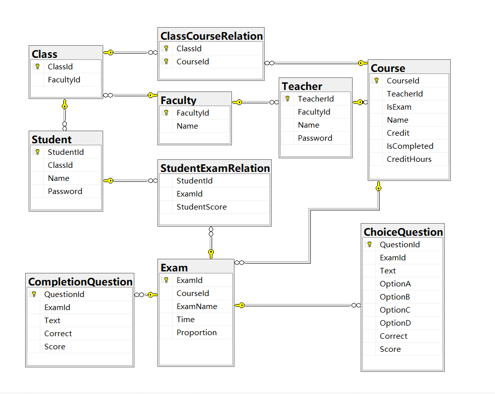

# TestOnline

 在线考试系统，采用ASP.Net+SqlSugar+SqlServer

## 如何使用？

### 安装SSMS数据库管理软件

安装链接：[https://aka.ms/ssmsfullsetup](https://aka.ms/ssmsfullsetup)

身份验证使用SqlServer身份验证

登录名：sa	密码：123456

加密方式为可选，其他选项默认

**请确保数据库能够打开，虽然不使用数据库代码依旧可以运行，但排除故障比较困难**

### 创建数据库

打开SSMS后使用快捷键Ctrl+O(字母O)打开script.sql，使用Ctrl+A选择全文，点击执行，即可创建空的项目数据库，数据库设计如图所示

或者打开scriptWithData.sql来导入包含测试数据的数据库

### 使用VS2022或Rider打开项目

**因为中文编码格式问题推荐使用VS2022打开项目**

使用IDE打开TestOnline.sln即可打开项目

### 点击开始调试(快捷键F5)运行项目
